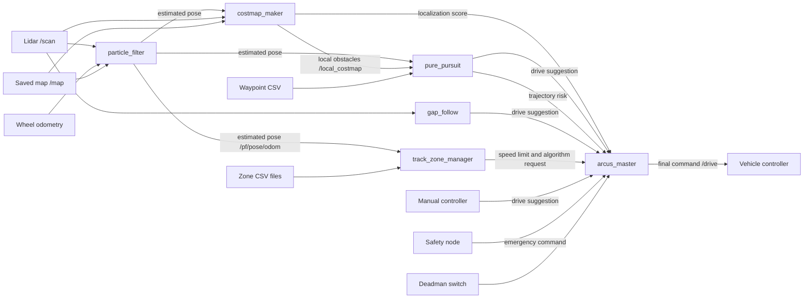

# Arcus autonomous driving system

This document explains how the main Arcus ROS 2 nodes work together. It assumes familiarity with basic ROS concepts such as nodes, topics, messages, parameters, launch files, and QoS, but does not assume experience with autonomous-navigation algorithms.

## The system in one sentence

Sensors describe the car and its surroundings, localization estimates where the car is, two driving algorithms propose commands, and `arcus_master` chooses the command that is finally sent to the vehicle.

## Main data flow

The two autonomous driving algorithms do not publish directly to the car. They publish candidate commands to `arcus_master`, which is the only node in this group that publishes the final `/drive` command.

## What each package does

| Package | Simple responsibility | Main input | Main output |
| --- | --- | --- | --- |
| [`particle_filter`](../particle_filter/README.md) | Estimates where the car is on the saved map | Lidar, wheel odometry, map | Localized pose |
| [`costmap_maker`](../costmap_maker/README.md) | Builds a short-range obstacle grid in front of the car | Lidar, pose, map | Local costmap and localization score |
| [`pure_pursuit`](../pure_pursuit/README.md) | Follows the saved waypoint path | Pose, waypoints, local costmap | Drive suggestion and path risk |
| [`gap_follow`](../gap_follow/README.md) | Steers through open lidar space without using the map; commonly used to overtake other cars | Lidar | Drive suggestion |
| [`track_zone_manager`](../track_zone_manager/README.md) | Applies instructions attached to regions of the track | Pose and zone CSV files | Speed limit and requested algorithm |
| [`arcus_master`](../arcus_master/README.md) | Selects one safe command and sends it onward | All drive suggestions and safety signals | Final `/drive` command |

## Normal autonomous-driving sequence

1. The lidar publishes nearby ranges on `/scan`, while wheel odometry reports vehicle motion.
2. `particle_filter` compares the lidar scan with `/map` and publishes its best pose estimate on `/pf/pose/odom`.
3. `pure_pursuit` uses that pose to select a point ahead on the waypoint loop and calculates a speed and steering angle.
4. At the same time, `costmap_maker` turns lidar hits into `/local_costmap`. `pure_pursuit` uses this grid to estimate whether its upcoming path is risky.
5. `gap_follow` independently reads the lidar and always prepares a map-free drive suggestion.
6. `track_zone_manager` checks whether the localized pose lies in a configured track zone. It may publish a speed limit or request an algorithm.
7. `arcus_master` checks safety, node health, risk, localization quality, zone instructions, and configured priorities. It publishes the selected command on `/drive`.

This cycle repeats continuously, allowing command selection to react to changes in localization, obstacles, and system health.

## Why there are two autonomous driving algorithms

`pure_pursuit` and `gap_follow` solve different problems:

| | Pure pursuit | Gap follow |
| --- | --- | --- |
| Uses saved map position | Yes | No |
| Uses waypoint path | Yes | No |
| Uses lidar | Indirectly through costmap risk | Directly |
| Main strength | Follows the intended racing line | Reacts to nearby open space |
| Main weakness | Depends on good localization and waypoints | Does not know the intended global route |

Pure pursuit is the normal path follower. Gap follow is valuable in sections explicitly configured for it and as a fallback when pure pursuit's planned path is risky or the localization/map agreement is poor. In practice, a high pure-pursuit trajectory risk is often because another car is present in the lane, so gap following is commonly used to overtake that vehicle.

## How `arcus_master` makes a decision

The decision can be understood in layers, from most important to least important:

1. **Deadman and emergency state:** stopping or safety behavior has priority over normal driving.
2. **Node availability:** a controller whose heartbeat has stopped is not trusted.
3. **Track-zone request:** a recent zone can request a specific available algorithm.
4. **Risk and localization:** pure pursuit is rejected when its path risk or the map-mismatch score crosses the configured threshold.
5. **Configured priority:** if several remaining sources are valid, the lowest numerical priority wins.
6. **Speed limit:** the selected positive speed is capped by any recent zone limit.

If no valid source remains, the master publishes zero speed and zero steering.

## The three map-like representations

These are related but should not be confused:

- The **saved map** (`/map`) is a fixed occupancy grid of the track environment. Localization compares lidar against it.
- The **localized pose** (`/pf/pose/odom`) is the particle filter's current estimate of the car's position and orientation on that map.
- The **local costmap** (`/local_costmap`) is a temporary grid near the car. It is rebuilt from current sensor data and represents nearby obstacle cost.

The waypoint CSV is not an occupancy map. It is simply an ordered loop of positions that pure pursuit should follow.

## Repository layout

The packages follow the usual ROS 2 layout:

- `src/` and `include/` contain the C++ implementation.
- `config/*.yaml` contains runtime parameters.
- `launch/*.launch.py` defines node startup and configuration loading.

Track zones and waypoints are stored under `resources/`. Several configured resource paths are absolute (`/home/arcus/arcus/...`), so they must match the deployment computer.

## A useful debugging order

When autonomous driving does not behave as expected, follow the data flow rather than changing parameters immediately:

1. Confirm that `/scan`, wheel odometry, and `/map` exist.
2. Confirm that `/pf/pose/odom` updates and that the pose is in the correct place on the map.
3. Confirm that `/local_costmap` contains sensible obstacles.
4. Check both proposed commands: `/pure_pursuit/drive` and `/disparity/drive`.
5. Check `/pure_pursuit/trajectory_risk`, `/costmap_maker/localization_score`, and the zone-manager outputs.
6. Check node heartbeats on `/node_error_code` and the deadman state.
7. Finally, compare the chosen `/drive` command with the two suggestions.

RViz is especially useful for viewing the saved map, localized pose, particles, local costmap, target waypoint, and risk path in the same coordinate system.

## Safety note

Documentation explains the software flow but does not replace trackside safety procedures. Test new parameters at low speed, keep the physical emergency stop accessible, and verify the final `/drive` output before allowing autonomous motion.
