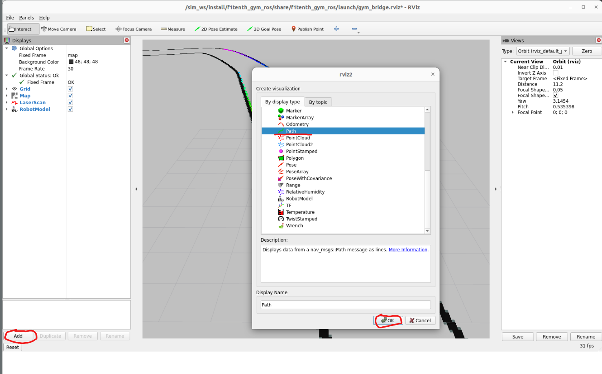
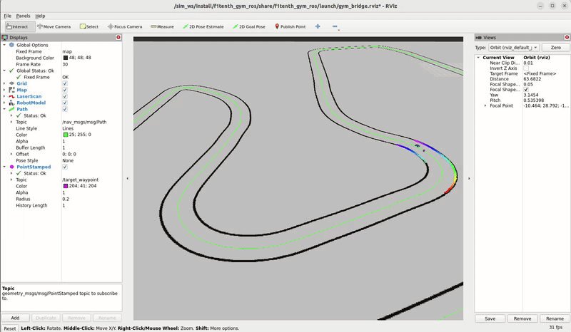

# pure_pursuit

See the [system overview](overview.md) for how this node interacts with the rest of Arcus.

`pure_pursuit` is the normal map-based driving algorithm. It follows a loop of saved XY points called *waypoints*.

Instead of steering directly at the closest waypoint, it selects a point farther ahead. This *lookahead point* produces smoother steering. The lookahead grows with speed. The node also calculates a safe target speed from path curvature, acceleration limits, and braking limits.

## Node behavior

- Executable: `pure_pursuit`; launched as `/arcus/pure_pursuit`.
- Default control rate: 38 Hz.
- Publishes an `arcus_msgs/msg/ErrorCode` heartbeat every 50 ms.

The node checks the chosen path against the local costmap and publishes a risk score. `arcus_master` can switch to gap following when that score is too high. If the car becomes stuck after moving, pure pursuit can briefly reverse to recover; its status message tells the master to preserve that recovery command.

## ROS interface

| Direction | Configured topic | Type |
| --- | --- | --- |
| Subscribe | `/pf/pose/odom` | `nav_msgs/msg/Odometry` |
| Subscribe | `/local_costmap` | `nav_msgs/msg/OccupancyGrid` |
| Publish | `/pure_pursuit/drive` | `ackermann_msgs/msg/AckermannDriveStamped` |
| Publish | `/target_waypoint` | `geometry_msgs/msg/PointStamped` |
| Publish | `/pure_pursuit/trajectory_risk` | `std_msgs/msg/Float32` |
| Publish | `/pure_pursuit/risk_path` | `nav_msgs/msg/Path` |
| Publish | `/node_error_code` | `arcus_msgs/msg/ErrorCode` |

All names are parameters. Odometry uses best-effort depth-1 QoS; the costmap uses sensor-data QoS. Risk samples are transformed from `map` to the costmap frame with TF.

## Waypoint file

`waypoints_file_path` identifies a headerless CSV with at least X and Y:

```csv
-1.25,3.40
-1.10,3.55
-0.92,3.68
```

The supplied absolute path is `/home/arcus/arcus/resources/waypoints/waypoints.csv`; adjust it for another installation. Malformed rows are not skipped.

## Parameters

| Group | Names | Purpose |
| --- | --- | --- |
| Lookahead | `min_lookahead_distance_m`, `max_lookahead_distance_m`, `lookahead_distance_gain`, `max_lookahead_fraction_of_path` | Target selection |
| Control | `wheelbase_m`, `loop_frequency_hz`, `reloc_distance_m` | Model, rate, relocalization |
| Speed | `speed_min`, `speed_max`, `a_lat_max`, `a_accel_max`, `a_brake_max`, `speed_eps` | Curvature and longitudinal limits |
| Risk | `risk_lookahead_gain`, `ttc_decay_rate`, `min_ttc_speed_mps`, `risk_interpolation_step_m` | Costmap horizon and weighting |
| Diagnostics | `debug` | Publish sampled risk path |

Exact deployed values are in `config/pure_pursuit_params.yaml`. Most tuning parameters can change at runtime; speed-related changes recalculate the profile. Topic names, loop frequency, and waypoint path are startup settings.

Before relying on its output, verify that the waypoint file exists and that odometry, the costmap, and coordinate transforms are available. `/target_waypoint` and `/pure_pursuit/risk_path` can be displayed in RViz while tuning.

## Visualising the path and the target waypoint

To help debug, improve and tweak our pure pursuit alogrithm, it's really helpful to be able to visualize the path (made out of the given waypoints), and the target waypoint in Rviz.

### Path

1. On the left menu, click on **Add** then select **Path** and click **Ok**.
2. Launch the helper node that publishes the waypoints given in the `arcus/resources/waypoints.csv` file (`ros2 run visualization waypoints_publisher`)
3. In the Rviz left menu, open the dropdown menu for the **Path** element and make sure the **topic** field matches the actual topic on which the waypoints are being published (ex: `/nav_msgs/msg/Path`). 



## Target waypoint

1. On the left menu, click on **Add** then select **PointStamped** and click **Ok**.
2. Make sure the pure_pursuit node is running, since it's the node responsible for publishing the target waypoint (`ros2 run pure_pursuit pure_pursuit`)
3. In the Rviz left menu, open the dropdown menu for the **PointStamped** element and make sure the **topic** field matches the actual topic on which the target waypoint is being published (ex: `/target_waypoints`)

## Results

You should see something like that! The path (in green) with the current selected waypoint in pink. Take a look at the left menu to make sure you have the same parameters if you're having issues. You can also customize the visuals with this menu (color, width, etc.).

.
