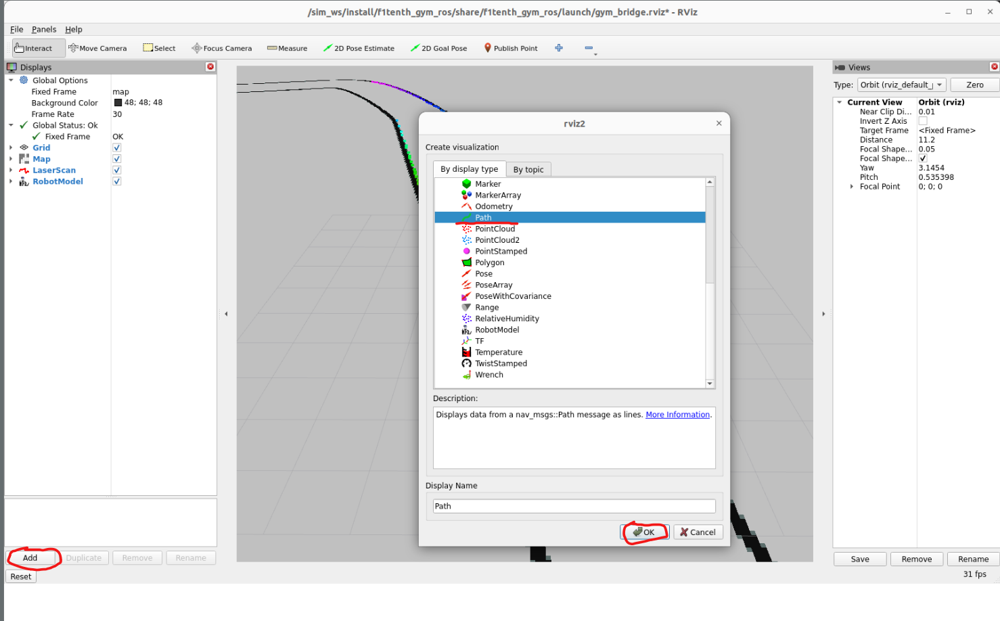
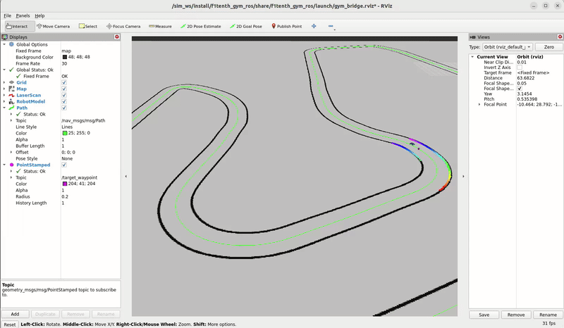

# Pure Pursuit Overview

## Introduction

Pure pursuit is a very popular control algorithm allowing robots to follow a given path with a steering angle.  

In our case, the brief I/O for our pure pursuit node:
- Input: CSV file containing waypoints for the wanted raceline (the waypoints in the CSV must be ordered in the correct way, meaning the way the car is expected to go). The file path is `arcus/resources/waypoints.csv`.
- Input: The accurate position of the car.

- Output: The computed steering angle that the car should take to catch up on its raceline on the given lookahead distance.

Basic steps:
1. Depending on the speed and a *gain* constant, compute the lookahead distance. Having an adaptive lookahead distance allows the car to oscillate less when going straight (faster) while staying reactive and sharp in corners (slower).
2. Find the waypoint in the waypoints list that is the most appropriate given the wished lookahead distance. This will be the target waypoint.
3. Do a bit of geometry to find the target steering angle.
4. Use this angle in the Ackerman drive command given to the car
5. Repeat at a given frequency: ex: 20 Hz

For detailed explanations, see: https://thomasfermi.github.io/Algorithms-for-Automated-Driving/Control/PurePursuit.html

## Visualising the path and the target waypoint

To help debug, improve and tweak our pure pursuit alogrithm, it's really helpful to be able to visualize the path (made out of the given waypoints), and the target waypoint in Rviz.

### Path

1. On the left menu, click on **Add** then select **Path** and click **Ok**.
2. Launch the helper node that publishes the waypoints given in the `arcus/resources/waypoints.csv` file (`ros2 run visualization waypoints_publisher`)
3. In the Rviz left menu, open the dropdown menu for the **Path** element and make sure the **topic** field matches the actual topic on which the waypoints are being published (ex: `/nav_msgs/msg/Path`). 

## Target waypoint

1. On the left menu, click on **Add** then select **PointStamped** and click **Ok**.
2. Make sure the pure_pursuit node is running, since it's the node responsible for publishing the target waypoint (`ros2 run pure_pursuit pure_pursuit`)
3. In the Rviz left menu, open the dropdown menu for the **PointStamped** element and make sure the **topic** field matches the actual topic on which the target waypoint is being published (ex: `/target_waypoints`)

## Results

You should see something like that! The path (in green) with the current selected waypoint in pink. Take a look at the left menu to make sure you have the same parameters if you're having issues. You can also customize the visuals with this menu (color, width, etc.).

.
