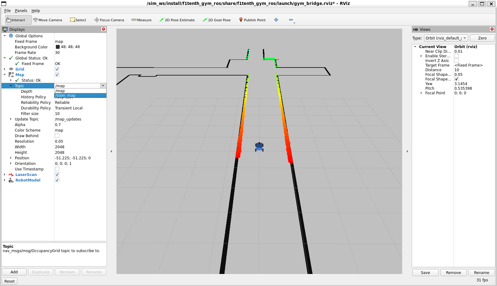
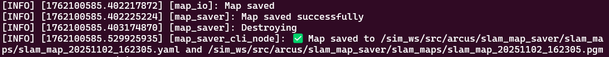

# SLAM

**Simultaneous Localization and Mapping (SLAM)** is the process by which a robot builds a map of an unknown environment while simultaneously determining its position within that map.

In our application, SLAM is primarily used to generate an initial map during the robot’s first laps. This map is later utilized by the **Adaptive Monte Carlo Localization (AMCL)** algorithm (our particle filter) to accurately localize the robot within the environment.

To understand better how SLAM works (pose graph optimization), see this video: 
https://www.mathworks.com/videos/autonomous-navigation-part-3-understanding-slam-using-pose-graph-optimization-1594984678407.html

We are using the slam_toolbox package for the SLAM itself. 
https://github.com/SteveMacenski/slam_toolbox

Its parameters can be changed inside the following file:
`/sim_ws/src/f1tenth_gym_ros/config/mapper_params_online_async.yaml`

## Using SLAM in Simulation

To enable SLAM in the simulation, update the configuration file:
```bash
cd /sim_ws/src/f1tenth_gym_ros/config
```
Open `sim.yaml` with your preferred text editor and set the following parameter:
```yaml
run_slam: True
```
Then simply launch the simulation normally:
```bash
ros2 launch f1tenth_gym_ros gym_bridge_launch.py
```
To visualize the map being generated, switch the map topic within RVIZ to slam_map:


Then you need to teleoperate the car to generate the map. The more laps you do, the better the map (more loop closures, see matlab vid).
Once you are happy with the map and want to save it, you need to run our slam_map_saver node in another terminal:
```bash
ros2 run slam_map_saver slam_map_saver
```
If the map saved successfully, it should log this message:


The map is then saved with a timestamp in the `/sim_ws/src/arcus/slam_map_saver/slam_maps` directory. The particle filter will then use the latest saved map to do AMCL.